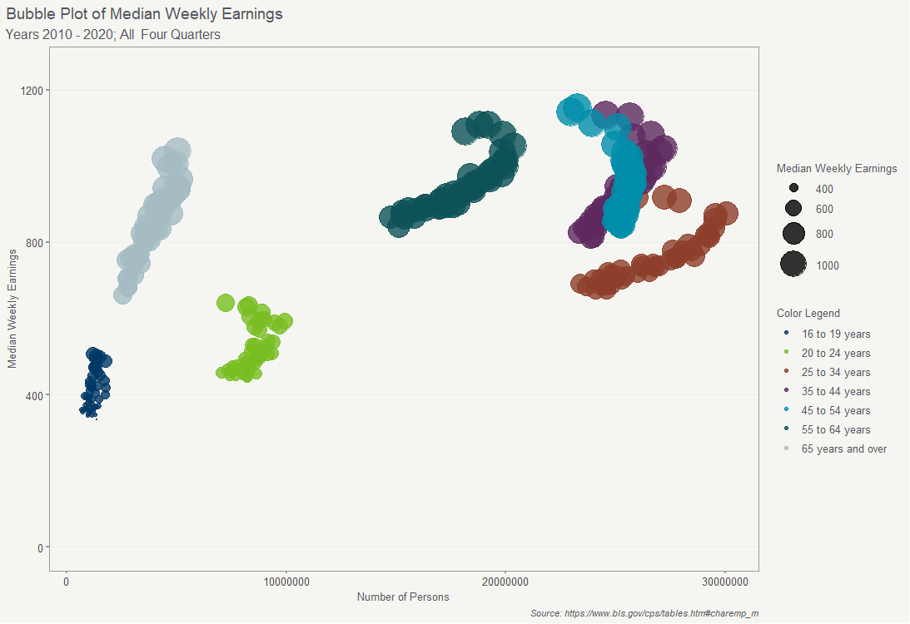

# Static Bubble Plot
 
 
 
 
<picture>
  <source media="(prefers-color-scheme: dark)" srcset="https://user-images.githubusercontent.com/25423296/163456776-7f95b81a-f1ed-45f7-b7ab-8fa810d529fa.png">
  <source media="(prefers-color-scheme: light)" srcset="https://user-images.githubusercontent.com/25423296/163456779-a8556205-d0a5-45e2-ac17-42d089e3c3f8.png">
  
</picture>

# Animated Bubble Plot

